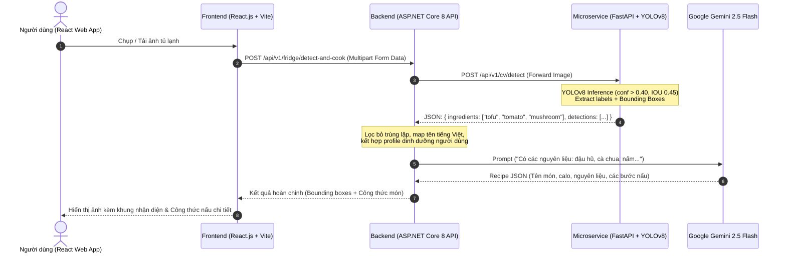

# Kế hoạch Triển khai Nhanh Tính năng Computer Vision (YOLOv8) - "Empty the Fridge" AI Chef (F-07)

Dự án: **VeggieLife** (SWP391 - FPT University)  
Phân hệ: **AI Engine / Computer Vision (Flow 4 - USP-1 - F-07)**  
Người phụ trách theo WBS: **Huỳnh Việt Phát (Frontend + AI Engineer)** & **Nguyễn Văn Minh Tâm (Lead Architecture)**

---

## 1. Tổng quan & Mục tiêu Kỹ thuật

Tính năng **"Empty the Fridge" AI Chef** cho phép người dùng chụp ảnh các nguyên liệu còn sót lại trong tủ lạnh. Hệ thống sẽ:
1. **Phát hiện đối tượng (Object Detection)**: Bóc tách tọa độ (bounding boxes) và định danh các loại rau, củ, quả, đậu hũ, nấm... bằng mô hình **YOLO**.
2. **Gom nhãn & Chuyển giao (Data Forwarding)**: Backend ASP.NET Core 8 nhận danh sách nguyên liệu và kết hợp với thông tin cá nhân (dị ứng, trường phái ăn chay).
3. **Sinh công thức món chay (Generative AI)**: Gửi danh sách nguyên liệu sang **Google Gemini 2.5 Flash** để tạo công thức món chay tối ưu, hạn chế lãng phí thực phẩm.

### Thách thức cốt lõi & Giải pháp "Triển khai nhanh" (Fast-Track Strategy):
- **Thách thức 1 (Mô hình COCO bị thiếu đồ chay Việt Nam)**: YOLO Pretrained gốc (COCO 80 classes) chỉ có *carrot, broccoli, apple, banana, orange*. Nó không thể nhận diện *đậu hũ (tofu), nấm rơm, nấm đùi gà, cà tím, mướp, bầu, rau muống*.
  - **Giải pháp**: 
    - *Giai đoạn 1 (Ngay lập tức)*: Dùng `yolov8n.pt` COCO pretrained làm mock/baseline pipeline để test kết nối Frontend - Backend - Microservice.
    - *Giai đoạn 2 (Tuần 3)*: Tận dụng các tập dataset rau củ mở trên Roboflow Universe + gán nhãn bổ sung các món đặc thù Việt Nam, fine-tune trên Google Colab (GPU T4 miễn phí) trong 30-45 phút, xuất file trọng số `veggie_best.pt`.
- **Thách thức 2 (Cloud Run Cold-start & Dung lượng Image)**: PyTorch thông thường kèm CUDA nặng > 4-5GB, làm Cloud Run khởi động lạnh mất 15-30 giây.
  - **Giải pháp**: Sử dụng PyTorch CPU-only build (`--extra-index-url https://download.pytorch.org/whl/cpu`) + `opencv-python-headless`. Dung lượng Docker image giảm xuống dưới **900MB**, Cold-start trên Cloud Run chỉ mất **~2-4 giây**, chi phí serverless gần như bằng 0.

---

## 2. Kiến trúc & Luồng dữ liệu (Data Flow)



---

## 3. Cấu trúc Thư mục Đề xuất cho Microservice CV

Dịch vụ Computer Vision sẽ được xây dựng độc lập trong repository này (`/Users/nguyenvanminhtam/Documents/ComputerVersion`), sẵn sàng đóng gói Docker và deploy:

```text
ComputerVersion/
├── app/
│   ├── __init__.py
│   ├── main.py                  # FastAPI app & CORS configuration
│   ├── config.py                # App settings, confidence threshold, paths
│   ├── models/
│   │   └── schemas.py           # Pydantic schemas (DetectionResponse, BoundingBox, etc.)
│   ├── services/
│   │   ├── yolo_service.py      # Ultralytics YOLO inference, NMS, label translation
│   │   └── preprocessor.py      # Image validation, resize, format checks
│   ├── weights/
│   │   ├── yolov8n.pt           # Pretrained baseline weight
│   │   └── veggie_best.pt       # Fine-tuned weight (cập nhật sau khi train)
│   └── api/
│       └── routes.py            # Endpoints: /health, /detect, /detect-annotated
├── data/
│   ├── labels_map.json          # Dictionary dịch nhãn Anh - Việt và danh mục dinh dưỡng
│   └── samples/                 # Ảnh mẫu tủ lạnh để kiểm thử API
├── training/                    # Script & notebook phục vụ Fine-tuning trên Colab
│   ├── train_colab.ipynb        # Jupyter Notebook huấn luyện trên Google Colab
│   └── data.yaml                # Cấu hình dataset Roboflow
├── tests/
│   ├── __init__.py
│   └── test_api.py              # Unit test và benchmark thời gian inference
├── Dockerfile                   # Docker build tối ưu CPU (< 900MB) cho Cloud Run
├── requirements.txt             # Dependencies (fastapi, uvicorn, ultralytics, opencv-headless, etc.)
├── .dockerignore
└── README.md                    # Hướng dẫn chạy local & deploy Google Cloud Run
```

---

## 4. Đặc tả API Contract (Giữa FastAPI và ASP.NET Core 8)

### Endpoint chính: `POST /api/v1/cv/detect`
- **Content-Type**: `multipart/form-data`
- **Body parameters**:
  - `file`: File ảnh tủ lạnh (`.jpg`, `.jpeg`, `.png`, `.webp`)
  - `confidence`: `float` (Tùy chọn, mặc định `0.40`)
  - `include_boxes`: `bool` (Tùy chọn, mặc định `true`)

### Response Format (JSON Standard):
```json
{
  "success": true,
  "execution_time_ms": 112.5,
  "ingredient_count": 4,
  "detected_ingredients": [
    {
      "name_en": "tofu",
      "name_vi": "Đậu phụ / Đậu hũ",
      "category": "Đạm thực vật",
      "count": 2,
      "max_confidence": 0.91
    },
    {
      "name_en": "tomato",
      "name_vi": "Cà chua",
      "category": "Rau củ quả",
      "count": 3,
      "max_confidence": 0.88
    },
    {
      "name_en": "mushroom",
      "name_vi": "Nấm",
      "category": "Rau củ quả",
      "count": 1,
      "max_confidence": 0.84
    }
  ],
  "bounding_boxes": [
    {
      "label": "tofu",
      "label_vi": "Đậu phụ",
      "confidence": 0.91,
      "box": {
        "x_min": 120,
        "y_min": 240,
        "x_max": 310,
        "y_max": 450
      }
    }
  ]
}
```

---

## 5. Lộ trình Triển khai Chi tiết (4 Giai đoạn Nhanh)

### Giai đoạn 1: Xây dựng Service Core & Local POC (Hoàn thành ngay - 1 ngày)
- Khởi tạo môi trường Python 3.11, cài đặt `fastapi`, `uvicorn`, `ultralytics`, `opencv-python-headless`.
- Tải mô hình `yolov8n.pt` nhẹ nhất (chỉ 6.2MB).
- Xây dựng API `/api/v1/cv/detect` và mapper nhãn thức ăn cơ bản (Anh - Việt).
- Viết test script kiểm thử với ảnh chụp rau củ thực tế.

### Giai đoạn 2: Tối ưu Docker & Cloud Run Config (1 ngày)
- Viết `Dockerfile` nhiều tầng, sử dụng PyTorch CPU wheel để thu nhỏ kích thước image.
- Thiết lập port linh hoạt theo biến môi trường `$PORT` (chuẩn Google Cloud Run).
- Viết tài liệu hướng dẫn nhóm build và deploy lên Google Artifact Registry & Cloud Run bằng lệnh `gcloud run deploy`.

### Giai đoạn 3: Thu thập Dataset & Fine-tune cho Nguyên liệu Chay Việt Nam (Sprint 3)
- Thu thập dataset trên Roboflow: Tìm kiếm các dataset có sẵn như *Vegetable detection*, *Vietnamese food ingredients*, bổ sung nhãn đặc thù: Đậu hũ trắng, đậu hũ chiên, nấm rơm, nấm đùi gà, rau thơm, bí xanh, mướp.
- Cung cấp sẵn file `training/train_colab.ipynb` để bạn Huỳnh Việt Phát chỉ cần mở trên Google Colab, bật GPU T4 và chạy lệnh train 50 epochs trong ~30 phút.
- Thay thế weights `veggie_best.pt` vào service mà không cần sửa bất kỳ dòng code API nào.

### Giai đoạn 4: Tích hợp với ASP.NET Core 8 & Gemini 2.5 Flash (Sprint 4 - Assessment 1)
- Cung cấp sample code `HttpClient` bằng C# (.NET 8) cho bạn Kỳ Thư / Minh Tâm để gọi sang FastAPI service.
- Cung cấp mẫu Prompt tối ưu cho Google Gemini 2.5 Flash để nhận diện input nguyên liệu và sinh công thức nấu ăn chuẩn chay.

---

## 6. User Review Required

> [!IMPORTANT]
> **Quyết định về Model ban đầu:**
> Trong giai đoạn đầu kiểm thử (ngay lúc này), chúng tôi sẽ thiết lập `yolov8n.pt` (Pretrained COCO) kèm bộ lọc các nhãn thực phẩm sẵn có để Backend và Frontend có API hoạt động ngay lập tức (Mock & Test Flow). Sau đó ở Sprint 3, nhóm sẽ thay thế file `best.pt` đã fine-tune cho nguyên liệu Việt Nam.

> [!TIP]
> **Tiết kiệm tài nguyên Cloud Run:**
> Cloud Run sẽ scale về 0 instance khi không có request, hoàn toàn miễn phí trong quota của Google Cloud (2 triệu request/tháng). Cold start của phiên bản CPU này chỉ mất ~2-3 giây.

---

## 7. Kế hoạch Kiểm thử (Verification Plan)

### Automated Tests
- Chạy unit tests `pytest tests/test_api.py` kiểm tra:
  1. Endpoint `/health` trả về trạng thái `OK` và thông tin model.
  2. Endpoint `/api/v1/cv/detect` nhận diện ảnh mẫu và trả về đúng định dạng schema Pydantic.
  3. Xử lý ngoại lệ khi upload file không phải là ảnh (trả về HTTP 400 rõ ràng).

### Manual Verification
- Dùng Swagger UI (`http://localhost:8080/docs`) tải ảnh chụp tủ lạnh hoặc khay rau củ lên để xem kết quả bounding box và thời gian inference (mục tiêu: < 200ms trên local CPU).
- Kiểm tra tính tương thích của Docker container: `docker build` và `docker run -p 8080:8080` chạy ổn định.
