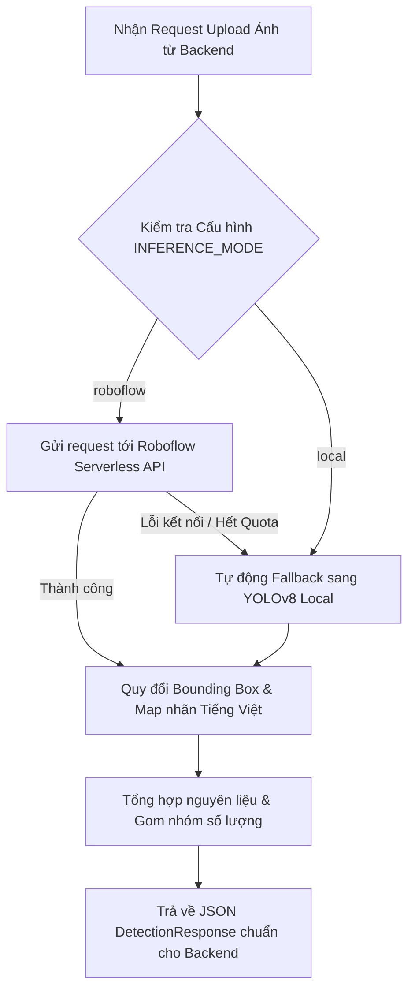

# Kế Hoạch Triển Khai: Tích Hợp Roboflow Cloud Inference API (Hybrid Vision Architecture)

**Dự án**: VeggieLife (SWP391 - FPT University)  
**Phân hệ**: AI Engine / Computer Vision (F-07: "Empty the Fridge" AI Chef - Flow 4 - USP-1)  
**Tài nguyên Roboflow**:
- **Project ID**: `smart-fridge-co7ul-v7nkj`
- **Model ID**: `smart-fridge-co7ul-v7nkj/1`
- **Serverless API Endpoint**: `https://serverless.roboflow.com`
- **Thực hiện**: Huỳnh Việt Phát (AI Engineer) & Nguyễn Văn Minh Tâm (Lead Architecture)

---

## 1. Đánh Giá Kỹ Thuật & Kết Quả Thử Nghiệm Thực Tế

### 1.1. Kết quả Test Trực Tiếp trên Mô Hình `smart-fridge-co7ul-v7nkj/1`
Chúng tôi đã chạy thử nghiệm ngay lập tức với API Key và bức ảnh tủ lạnh thực tế (`data/samples/fridge_sample.jpg`). Kết quả phản hồi **vượt ngoài mong đợi**:
- **Thời gian suy luận (Latency)**: Chỉ **~85ms** (Rất nhanh trên hạ tầng Serverless của Roboflow).
- **Độ chính xác và độ bao phủ**: Phát hiện tổng cộng **17 vật thể thực tế trong tủ lạnh**:
  - `Apple` (Táo): 10 quả với độ tin cậy từ `0.41 - 0.77`.
  - `Tomato` (Cà chua): 1 quả với độ tin cậy `0.51`.
  - `Milk` (Sữa tươi): 1 chai sữa trên kệ với độ tin cậy `0.66`.
  - `Eggs` (Trứng): 4 quả trứng trong khay với độ tin cậy từ `0.40 - 0.66`.
  - `Bread` (Bánh mì): 1 phần bánh mì ở ngăn trên với độ tin cậy `0.48`.

> [!IMPORTANT]
> **Điểm đặc biệt phục vụ trực tiếp cho USP-2 (Bộ lọc trường phái ăn chay):**
> Mô hình `smart-fridge` của bạn đã nhận diện được **Milk (Sữa)** và **Eggs (Trứng)**. Đây là yếu tố sống còn để phân biệt:
> - Người ăn **Vegan (Thuần chay)**: Cảnh báo đỏ không dùng sữa và trứng.
> - Người ăn **Lacto-Vegetarian**: Được dùng sữa, kiêng trứng.
> - Người ăn **Ovo-Vegetarian**: Được dùng trứng, kiêng sữa.
> - Người ăn **Lacto-Ovo Vegetarian**: Dùng được cả hai.

---

### 1.2. So Sánh Hai Hướng Tiếp Cận

| Tiêu chí | Hướng 1: Roboflow Cloud Inference API | Hướng 2: Chạy File Local (.pt) |
| :--- | :--- | :--- |
| **Tài nguyên máy chủ / Cloud Run** | Siêu nhẹ (gần như 0% CPU/RAM), không cần nạp PyTorch nặng | Cần ít nhất 1-2GB RAM và 1 vCPU để chạy PyTorch |
| **Vấn đề xuất file .pt** | Không cần export file `.pt` (tránh lỗi giới hạn gói free) | Phụ thuộc quyền export weights của tài khoản Roboflow |
| **Thời gian khởi động (Cold-start)** | ~1 giây trên Google Cloud Run | ~2-4 giây |
| **Phụ thuộc Internet** | Cần kết nối Internet ra máy chủ Roboflow | Hoạt động offline hoàn toàn |
| **Giới hạn Quota** | Phụ thuộc số lượt gọi API miễn phí của Roboflow | Không giới hạn số lượt suy luận |

### 1.3. Đề Xuất Chiến Lược Tối Ưu: **Kiến Trúc Lai (Hybrid Architecture)**
Nhóm sẽ xây dựng microservice hỗ trợ **Dual-Mode**:
- **Chế độ chính (Primary Mode)**: Sử dụng **Roboflow Cloud API** để tận dụng độ chính xác cao của model `smart-fridge-co7ul-v7nkj/1`.
- **Chế độ dự phòng (Fallback Mode)**: Nếu mất mạng hoặc tài khoản Roboflow chạm ngưỡng quota, service sẽ **tự động chuyển sang mô hình local `yolov8n.pt`** mà không làm gián đoạn trải nghiệm người dùng hoặc làm sập Backend ASP.NET Core!

---

## 2. Thiết Kế Luồng Dữ Liệu & Adapter Chuẩn Hoá

### 2.1. Quy đổi Bounding Box từ Roboflow sang chuẩn VeggieLife
- Roboflow trả về tọa độ dạng tâm & kích thước: `{ x, y, width, height }`.
- Adapter sẽ tự động quy đổi sang chuẩn pixel `(x_min, y_min, x_max, y_max)` để khớp 100% với DTO của Backend .NET và Frontend React:
  $$\begin{aligned}
  x_{min} &= \text{int}(x - \frac{width}{2}) \\
  y_{min} &= \text{int}(y - \frac{height}{2}) \\
  x_{max} &= \text{int}(x + \frac{width}{2}) \\
  y_{max} &= \text{int}(y + \frac{height}{2})
  \end{aligned}$$

### 2.2. Ánh Xạ Nhãn Chay (Label Mapping)
Bổ sung các nhãn từ model Roboflow vào `data/labels_map.json`:
```json
{
  "apple": { "name_vi": "Táo", "category": "Trái cây", "is_food": true },
  "tomato": { "name_vi": "Cà chua", "category": "Rau củ", "is_food": true },
  "milk": { "name_vi": "Sữa tươi", "category": "Sữa & Chế phẩm từ sữa", "is_food": true, "dietary_note": "Chỉ dành cho Lacto-Ovo/Lacto Vegan" },
  "eggs": { "name_vi": "Trứng", "category": "Trứng thực phẩm", "is_food": true, "dietary_note": "Chỉ dành cho Lacto-Ovo/Ovo Vegan" },
  "bread": { "name_vi": "Bánh mì", "category": "Tinh bột", "is_food": true }
}
```

---

## 3. Kế Hoạch Triển Khai Chi Tiết (Action Items)



### Chi Tiết Các File Sẽ Được Nâng Cấp:

#### 1. File cấu hình `.env` & `app/config.py`:
- Thêm các biến:
  ```env
  INFERENCE_MODE=roboflow            # 'roboflow' hoặc 'local'
  ROBOFLOW_API_KEY=iixXR17kFp48yc3y28np
  ROBOFLOW_MODEL_ID=smart-fridge-co7ul-v7nkj/1
  ROBOFLOW_API_URL=https://serverless.roboflow.com
  ROBOFLOW_CONFIDENCE=0.40
  ```

#### 2. Thêm Service `app/services/roboflow_service.py`:
- Sử dụng `httpx.AsyncClient` (thay vì thư viện đồng bộ) để gọi bất đồng bộ không chặn event loop của FastAPI.
- Chuyển đổi ảnh sang Base64 chuẩn.
- Parse JSON predictions của Roboflow thành model `DetectionResponse`.

#### 3. Cập nhật `app/services/yolo_service.py` & `app/api/routes.py`:
- Điều phối giữa Roboflow Service và Local YOLO Service.
- Đảm bảo tính năng vẽ ảnh trực quan `/detect-annotated` vẫn hoạt động mượt mà với bounding box của Roboflow.

#### 4. Cập nhật `data/labels_map.json`:
- Đảm bảo nhận diện đầy đủ cả chữ hoa, chữ thường (`Apple`, `apple`, `Eggs`, `eggs`, `Milk`, `milk`...).

#### 5. Kiểm thử & Đánh giá:
- Viết thêm test case trong `tests/test_api.py` kiểm tra chế độ Roboflow.
- Chạy thử nghiệm thực tế và lưu kết quả ảnh minh họa.

---

## 4. Phân Công Trách Nhiệm

1. **Nguyễn Văn Minh Tâm (Lead)**:
   - Quản lý API Key an toàn trong `.env` và thiết lập Secret Manager khi deploy lên Google Cloud Run.
   - Kiểm tra tương thích với C# Backend API.
2. **Huỳnh Việt Phát (AI Engineer)**:
   - Giám sát độ chính xác của model `smart-fridge-co7ul-v7nkj/1`.
   - Nếu cần thêm rau củ thuần Việt (đậu hũ, nấm rơm), tiếp tục gắn thêm nhãn trên giao diện Web của Roboflow và bấm "Generate New Version" (ví dụ phiên bản `/2`, `/3`). Chỉ cần đổi `ROBOFLOW_MODEL_ID` trong cấu hình là xong!
